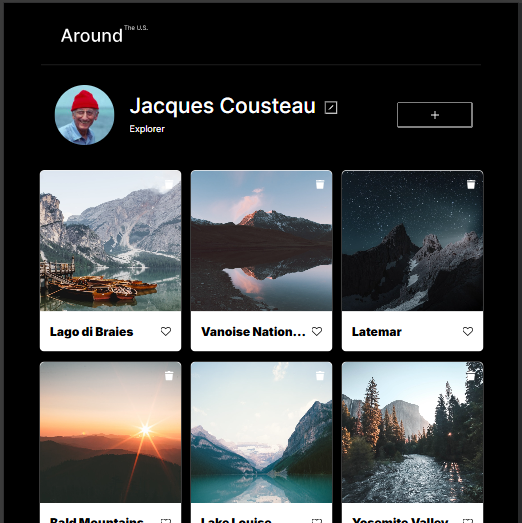

<!-- markdownlint-disable MD033 -->
<h1 align="center">🌎 Around The U.S.</h1>

Responsive Photo Gallery built with HTML, CSS, and JavaScript

  

  
  
  
  
  

A responsive web application showcasing beautiful locations across the United States.

Built using modern frontend development practices including **semantic HTML, responsive design, BEM architecture, and interactive UI components.**

---

  

---

## 📌 Project Overview

The **Around The U.S.** project is a responsive photo gallery designed to demonstrate modern frontend development principles.

Users can browse image cards, interact with modal windows, and view a clean responsive layout that adapts across desktop, tablet, and mobile devices.

This project focuses on building a strong foundation in:

- responsive layout design
- component-based styling
- semantic markup
- interactive UI elements

---

## ✨ Features

✔ Responsive image gallery  
✔ Profile editing modal  
✔ Image card layout  
✔ Clean modern UI  
✔ Mobile-first responsive design  
✔ Semantic HTML structure  
✔ BEM-based CSS architecture  

---

## 🛠 Technologies Used

| Technology | Purpose |
| ------------ | --------- |
| **HTML5** | Semantic page structure |
| **CSS3** | Layout and styling |
| **JavaScript** | Interactivity and modals |
| **Flexbox** | Layout alignment |
| **Grid Layout** | Responsive structure |
| **BEM Methodology** | Scalable CSS architecture |

---

## 📱 Responsive Design

The layout adapts smoothly across multiple screen sizes:

- 🖥 Desktop
- 💻 Tablet
- 📱 Mobile

---

## 📷 Screenshots

### Desktop Layout

### Tablet Layout

### Mobile Layout

---

## 🎥 Project Demo

Watch the demo:

https://github.com/FHobbs8030/se_project_aroundtheus/raw/main/demo/aroundtheus_demo.mp4

---

## 🔮 Future Improvements

Planned enhancements include:

- Adding additional JavaScript interactivity
- Expanding modal functionality
- Improving animations and transitions
- Enhancing accessibility
- Refactoring components for scalability

---

## 📚 About My Software Engineering Journey

For the past few years I’ve been working toward transitioning into **Software Engineering** and building real development skills.

The journey has included learning full-stack development, building projects, and deploying applications. It’s been challenging at times but incredibly rewarding to see everything start coming together.

If you're interested in learning Software Engineering, you can check out the program I'm currently studying through:

👉 [TripleTen Software Engineering Program](https://get.tripleten.com/sE7B)

---

## 👨‍💻 Author

### Fred Hobbs

Front-End Software Engineer  
HTML | CSS | JavaScript | Responsive Design

🔗 GitHub  
[GitHub Profile](https://github.com/FHobbs8030)
